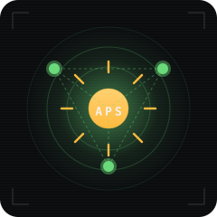
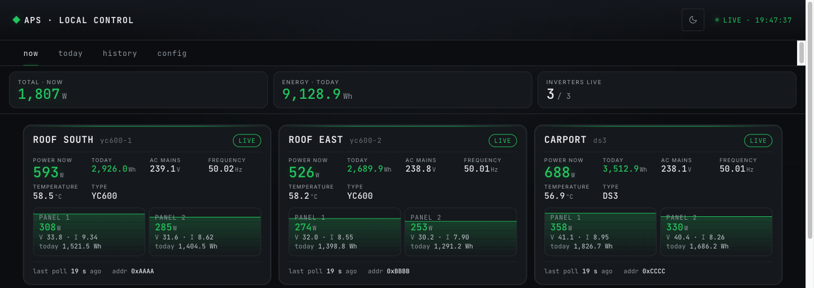
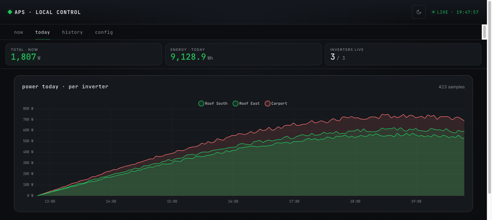
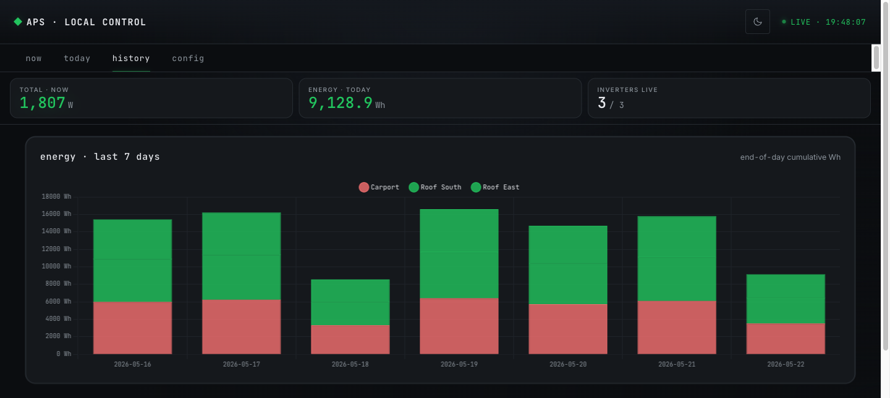

<p align="center">
  
</p>

<h1 align="center">APsystems Open Bridge</h1>

<p align="center">
  <b>Self-host APsystems solar telemetry with one Sonoff USB dongle.</b><br>
  No cloud. No ECU-R. Fully open-source.
</p>

<p align="center">
  <a href="LICENSE"></a>
  
  
  
</p>

---

## ☀️ What is this?

A small daemon + dashboard that talks **directly to APsystems YC600 / QS1 / DS3
micro-inverters** over their proprietary 2.4 GHz radio protocol — so the inverter
data stays on the local network and never leaves the house.

The only hardware needed besides the Pi is a **Sonoff ZBDongle-P (~€20)** flashed
with the open-source firmware in this repo. No APsystems ECU-R, no vendor
account, no cloud round-trip.

> 💡 The official ECU-R + EMA cloud pipeline works fine for most people, but locks
> the telemetry inside a vendor portal with a ~5-minute lag and an undocumented
> API. This project gives you the raw frames on the wire, decoded into JSON,
> with ~30 s latency.

## ✨ Features

- 🔌 **One dongle, all families.** YC600 (2-panel), QS1 (4-panel), DS3 (dual-MPPT)
  polled through the same Sonoff CC2652P — no separate hardware per model.
- 🧱 **Fully open radio stack.** Custom raw-802.15.4 firmware built from the TI
  SimpleLink SDK + Contiki-NG RF config. No closed-source binary blobs on the
  radio. Source in [`firmware/`](firmware/).
- 📡 **+20 dBm high-PA TX.** Reach inverters through walls / from outbuildings.
  EU SRD ceiling, configurable from the web UI.
- 🐍 **Pure-Python daemon.** Stdlib `http.server` for the web UI, stdlib MQTT
  client optional, no Node build, no npm. Installs on a Pi Zero 2 W.
- 📺 **Live dashboard.** Per-inverter cards with per-panel V/I/W/Wh, AC voltage,
  frequency, temperature. 7-day energy history. Editable inverter list.
- 🏠 **Home Assistant ready.** MQTT auto-discovery — devices show up as native
  HA entities with the right unit + icon.
- 🛡️ **Self-healing.** USB-stuck watchdog probes the dongle directly with
  `PKT_PING` heartbeat; recovers from `xhci_hcd` reset half-states without an
  operator. Survives sunset → sunrise silent windows without false alarms.
- 🐳 **Docker or systemd.** Either works. Compose stack in
  [`docs/docker.md`](docs/docker.md); systemd units in
  [`host/`](host/).

## 🛒 Hardware

| | Part | ~Price | Where |
|---|---|---|---|
| 🔑 Coordinator | **Sonoff ZBDongle-P** (CC2652P) | €20 | Sonoff / Aliexpress / Amazon |
| 🖥️ Host | Raspberry Pi 4 / Zero 2 W / any small Linux box | €15-50 | — |

> The Sonoff ZBDongle-P **Plus** (V1 or V2) variant is required — it has the
> CC2652P with the high-PA front-end. The older ZBDongle-E (EFR32) is **not**
> supported (yet).

## 🚀 Quick start (Docker on a Pi)

```bash
# 1. Plug the Sonoff dongle into the Pi. Confirm it appears as /dev/ttyUSB0:
ls -l /dev/serial/by-id/ | grep Sonoff

# 2. Flash the dongle (one-time, from any Chrome / Edge machine):
#    https://samr037.github.io/apsystems-bridge/ — click Connect, click Flash.

# 3. Clone and start the stack:
git clone https://github.com/samr037/apsystems-bridge.git
cd apsystems-bridge
docker compose up -d

# 4. Open the dashboard:
xdg-open http://your-pi.local:8088
```

That's it. The web UI walks you through adding inverters; no JSON editing
required. Telemetry starts streaming once the first inverter is paired and its
short address is known.

Bare-metal systemd units are provided in `host/` (`aps-unified.service`,
`aps-webui.service`) for those who prefer running without Docker.

### Home Assistant add-on

If Home Assistant runs on the machine the dongle plugs into — and within
radio range of the inverters — install the add-on instead of the compose
stack:

1. **Settings → Add-ons → Add-on Store → ⋮ → Repositories** — add
   `https://github.com/samr037/apsystems-bridge`
2. Install **APsystems Open Bridge**, set the `serial_device` option, start it.

MQTT is auto-configured from the Supervisor broker and the inverters
appear via MQTT discovery — see [`addon/DOCS.md`](addon/DOCS.md). The
runtime image is also published to `ghcr.io/samr037/apsystems-bridge`
for direct `docker run` use.

### One-click web flasher (Chrome / Edge)

Flash the dongle from your browser — no Python or CLI required:
**[`samr037.github.io/apsystems-bridge`](https://samr037.github.io/apsystems-bridge/)** — plug it in, click **Connect**, click **Flash**.
Works in any Chromium-based browser via the Web Serial API. See
[`flasher/README.md`](flasher/README.md) for the protocol details.

## 🏗️ How it works

```
┌─────────────────────────┐
│ APsystems YC600 / QS1   │  proprietary 2.4 GHz IEEE 802.15.4
│ DS3 micro-inverters     │  (unencrypted, vendor APS payloads)
└──────────┬──────────────┘
           ▼
┌─────────────────────────┐
│ Sonoff ZBDongle-P       │  raw-802.15.4 firmware (this repo)
│ (CC2652P) — €20         │  USB-CDC, COBS-framed bridge protocol
└──────────┬──────────────┘
           │  USB
           ▼
┌─────────────────────────┐
│ Raspberry Pi / Linux    │  Python daemon
│                         │   ├─ pair + poll loop (every 30 s)
│                         │   ├─ decode → JSONL + memory
│                         │   ├─ watchdog (PKT_PING heartbeat)
│                         │   └─ MQTT publisher (HA discovery)
└──┬───────────────────┬──┘
   │                   │
   ▼                   ▼
┌──────────┐    ┌────────────┐
│ Web UI   │    │  MQTT /    │
│ :8088    │    │  Home      │
│          │    │  Assistant │
└──────────┘    └────────────┘
```

Polls go out as **inter-PAN unicast** frames (`MAC 0x8861 + NWK 0x0008 + APS
cluster 0x0006 / profile 0x0F05`) — the format APsystems' own ECU uses on the
wire, reverse-engineered from public captures. The full byte-level protocol
reference is in [`docs/aps-protocol.md`](docs/aps-protocol.md).

## 📊 Dashboard

The web UI is a single self-contained page (Alpine.js + Chart.js, no build
step) served by stdlib `http.server`. Tabs: **Now** (live cards),
**Today** (energy curves), **History** (last 7 days), **Config** (inverters,
MQTT, radio, retention, logging).







## 🤝 Prior art & credit

This project stands on years of community reverse-engineering work — credit
where it's due:

| | |
|---|---|
| **[patience4711](https://github.com/patience4711)** ([ESP32](https://github.com/patience4711/ESP32-read-APS-inverters) / MIT, [ESP8266](https://github.com/patience4711/read-APSystems-YC600-QS1-DS3), [Raspberry Pi](https://github.com/patience4711/RPI-APS-inverters)) | The original APsystems decoder. The telemetry formulas in `host/aps_unified_daemon.py` are a clean-room port of the MIT-licensed ESP32 implementation. The set-power and reboot frame formats also come from there. |
| **kadzsol** | First reverse-engineered the on-air protocol and shipped a modified Z-Stack firmware for CC2530/CC2531. License **CC BY-NC-SA 3.0**. This project doesn't redistribute kadzsol's hex; users flash it themselves if they want the legacy path. |
| **No13** ([`ApsYc600-Pythonlib`](https://github.com/No13/ApsYc600-Pythonlib)) | First public Python pair+poll for kadzsol coordinators. |
| **[Koenkk/zigbee2mqtt#4221](https://github.com/Koenkk/zigbee2mqtt/issues/4221)** | The 823-comment thread where the protocol was reverse-engineered in 2020. |
| **[nccgroup/Sniffle](https://github.com/nccgroup/Sniffle)** | Reference headless CC2652 firmware build — informed the makefile + linker setup. |
| **[Contiki-NG](https://github.com/contiki-ng/contiki-ng)** | Open-source CC13x2 / CC26x2 IEEE 802.15.4 RF configuration. |

## 🔄 Related projects

Picking an open APsystems-monitoring stack? Honest comparison:

| Project | Hardware | Best for |
|---|---|---|
| **This project** | Sonoff CC2652P + Linux host | Linux-comfortable users who want one stack for *all* APsystems families incl. DS3, with MQTT/HA integration and Docker. |
| [**patience4711 / ESP32-read-APS-inverters**](https://github.com/patience4711/ESP32-read-APS-inverters) (MIT) | ESP32 + CC2531 + kadzsol firmware | Standalone WiFi box — no Linux host needed. Mature, embedded web UI, OTA updates. |
| [**OpenDTU**](https://github.com/tbnobody/OpenDTU) / [**AhoyDTU**](https://github.com/lumapu/ahoy) | ESP32 + NRF24L01+ / CMT2300A | Hoymiles inverters — different vendor, different radio. |

The patience4711 ecosystem and this project are complementary. Both can publish
to the same MQTT broker; the choice comes down to whether to have a standalone
WiFi box (his) or integrate with an existing Linux home server (this one).

## 📂 Layout

| Path | Contents |
|---|---|
| [`firmware/`](firmware/) | Custom CC2652P raw-802.15.4 firmware sources + [`BUILD.md`](firmware/BUILD.md). |
| [`host/aps_bridge/`](host/aps_bridge/) | Serial transport + COBS framing to the dongle (`bridge.py`). |
| [`host/aps_unified_daemon.py`](host/aps_unified_daemon.py) | Production daemon — pairs + polls all 3 inverter families via the Sonoff dongle. |
| [`host/webui/`](host/webui/) | Single-file Alpine.js + Chart.js dashboard. |
| [`tools/`](tools/) | Dongle bring-up / serial debug utilities. |
| [`docs/`](docs/) | Protocol spec, Docker quickstart, firmware audit. |
| [`addon/`](addon/) | Home Assistant add-on — config, Dockerfile, run script. |
| [`flasher/`](flasher/) | Browser-based dongle flasher — Web Serial, deployed via GitHub Pages. |

## 📜 License & regulatory

- **Code** in this repo: MIT — see [`LICENSE`](LICENSE).
- **Third-party attribution**: see [`THIRD_PARTY_NOTICES.md`](THIRD_PARTY_NOTICES.md).

This repo distributes **source code only**. Flashing this firmware onto a
2.4 GHz radio shifts regulatory responsibility from the dongle manufacturer to
the operator. Default radio parameters are well within EU SRD and FCC Part 15
ISM-band limits:

| Parameter | Default | EU SRD limit | FCC Part 15.247 |
|---|---|---|---|
| TX power | +5 dBm | +20 dBm EIRP | +30 dBm |
| Channels | 11–26 (2405–2480 MHz, IEEE 802.15.4) | within 2400–2483.5 MHz ISM | within 2400–2483.5 MHz ISM |
| Activity | short bursts every 30 s per inverter | well below duty-cycle caps | well below duty-cycle caps |

The UI exposes the full -20..+20 dBm range. +20 sits at the EU SRD ceiling —
leave headroom for any antenna gain in your install.

## 🔐 Security

The web UI binds to `0.0.0.0:8088` with **no built-in authentication** — this
is appropriate for a trusted home-lab LAN, **not** for direct internet
exposure. Put it behind a reverse proxy with auth (Caddy + basic-auth, Authelia,
Tailscale Serve, etc.) before opening to the public. MQTT passwords are masked
in `GET /api/mqtt` responses.

Vulnerability disclosure policy: [`SECURITY.md`](SECURITY.md).

## 📈 Status

Active project. Production deployment polls 3 inverters every 30 s with ~95%
success rate; telemetry streams to local JSONL + (optional) MQTT.

- **Protocol reference** — [`docs/aps-protocol.md`](docs/aps-protocol.md)
- **Open work** — [GitHub issues](https://github.com/samr037/apsystems-bridge/issues)
- **Contributing** — [`CONTRIBUTING.md`](CONTRIBUTING.md)

Stars, issues, and PRs welcome. ⭐
